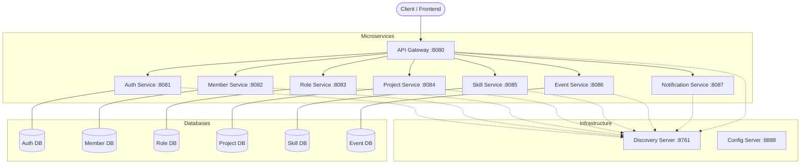

# ☁️ CoderRide Cloud Infrastructure

Welcome to the **CoderRide Developer Community Platform**! This is the parent infrastructure repository that manages all of our microservices using Git Submodules. 

## 🏗️ Architecture Overview

The platform is built on a **Java 21 Spring Boot** microservice architecture, utilizing Spring Cloud Gateway for routing, Eureka for service discovery, and PostgreSQL for data persistence.



## 🛠️ Prerequisites

- **Java 21**
- **Maven**
- **Docker & Docker Compose** (for running Postgres databases locally)
- **Git**

## 🚀 Getting Started

### 1. Cloning the Repository
Since this repository uses Git Submodules, you must clone it recursively:
```bash
# Easy method (using the provided script if you downloaded it)
./clone-setup.sh

# Or manual Git command:
git clone --recurse-submodules https://github.com/CoderRide-Cloud/coder-ride-infrastructure.git
```

### 2. Environment Variables
Copy the template to create your local `.env` file:
```bash
cp .env.example .env
```
Update `.env` with your actual Postgres passwords and GitHub OAuth credentials.

### 3. Starting the Databases
We provide a `docker-compose.yml` to spin up all 6 required PostgreSQL databases:
```bash
docker-compose up -d
```

## 👨‍💻 Developer Workflow Tools

To manage 10 microservices easily, use our custom Bash scripts located in this root directory:

- `./push-all.sh "Your commit message"`: Automatically checks `git status` in every microservice, commits changes, and pushes to GitHub. It also updates this parent repository to save the new submodule hashes.
- `./pull-all.sh`: Fetches and pulls the latest changes for the parent repository and all 10 microservices.
- `./fix-ssh.sh`: Updates your Git remotes to use a specific `-work` SSH profile if you have multiple GitHub accounts.

## 📦 Microservices Directory

Explore the individual READMEs for detailed API information and service-specific architectures:

* [Auth Service](./auth-service) - JWT & GitHub OAuth.
* [Member Service](./member-service) - Developer Profiles.
* [Role Service](./role-service) - RBAC.
* [Project Service](./project-service) - Portfolios & Projects.
* [Skill Service](./skill-service) - Developer Skills.
* [Event Service](./event-service) - Community Events.
* [Notification Service](./notification-service) - Asynchronous notifications.
* [Common Lib](./common-lib) - Shared DTOs and Exceptions.
